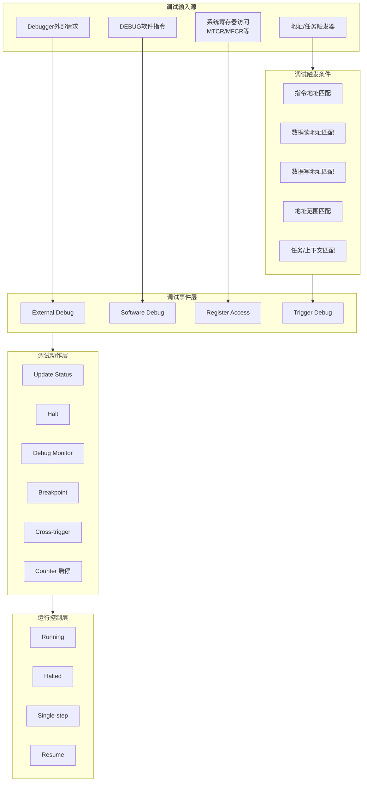

```mermaid
flowchart TB
    subgraph Input[调试输入源]
        direction LR
        I1[Debugger外部请求]
        I2[DEBUG软件指令]
        I3[系统寄存器访问<br/>MTCR/MFCR等]
        I4[地址/任务触发器]
    end

    subgraph Trigger[调试触发条件]
        T1[指令地址匹配] & T2[数据读地址匹配] & T3[数据写地址匹配]
        T4[地址范围匹配] & T5[任务/上下文匹配]
    end

    subgraph Event[调试事件层]
        E1[External Debug] & E2[Software Debug]
        E3[Register Access] & E4[Trigger Debug]
    end

    subgraph Action[调试动作层]
        A1[Update Status] & A2[Halt] & A3[Debug Monitor]
        A4[Breakpoint] & A5[Cross-trigger] & A6[Counter 启停]
    end

    subgraph Run[运行控制层]
        direction LR
        R1[Running]
        R2[Halted]
        R3[Single-step]
        R4[Resume]
    end

    I1 --> E1
    I2 --> E2
    I3 --> E3
    I4 --> Trigger
    Trigger --> E4
    Event --> Action
    Action --> Run
```